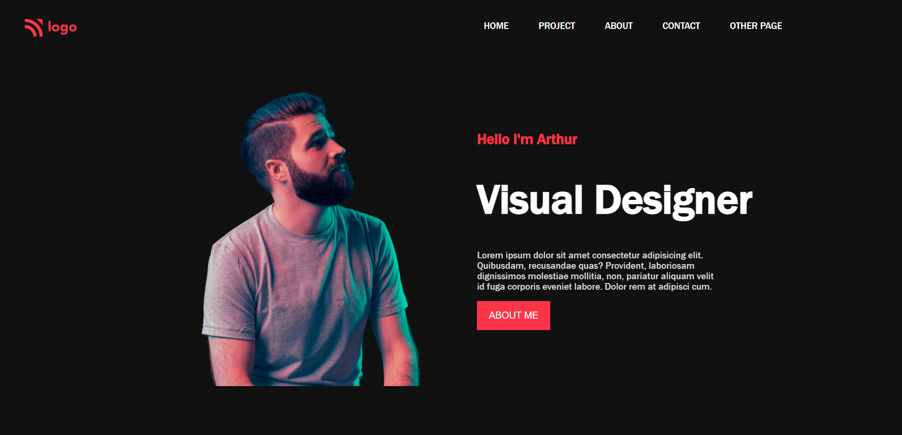

# Project 15 - HTML and CSS

By Piyush Bhatt

Deployed link of website &nbsp; 

 

# [Link to Project 15](https://product-design-landingpage-sooty.vercel.app/)

 

# Preview of the Project.

 

## What I learnt in this Project?

- I learned about how to make website **layout** through **flexbox.**
- I also learnt about how to make **cards** and arrange them using flex properties.
- I also learnt how to **arrange svg** images.
- I also learnt to make beautiful **buttons**.
- I learn to write **HTML** according to **DOM**

  

# Time Taken to complete  this project is 6 hour.